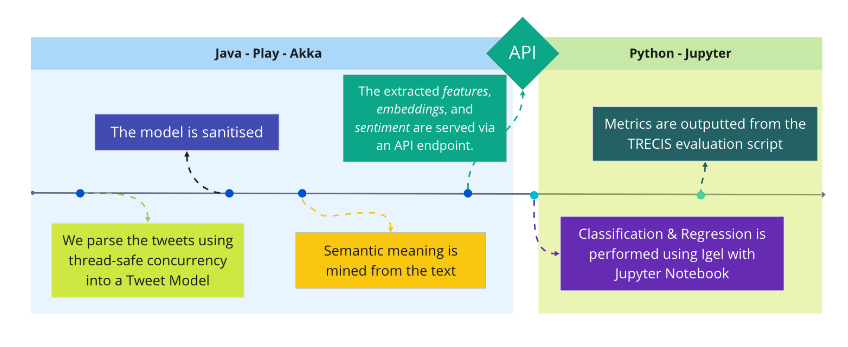

<!-- PROJECT LOGO -->
 

  

  <h3 align="center">Calamity</h3>

  

   An Intelligent System for Disaster Management
     
    <a href="https://github.com/glasgowm148/HelpMe/tree/main/HelpMe/0-data/docs"><strong>Explore the docs »</strong></a>
     
     
    <a href="https://github.com/glasgowm148/HelpMe/0-data/screenshots">View Demo</a>
    ·
    <a href="https://github.com/glasgowm148/HelpMe/issues">Report Bug</a>
    ·
    <a href="https://github.com/glasgowm148/HelpMe/issues">Request Feature</a>
  

<!-- TABLE OF CONTENTS -->

  
<h2 style="display: inline-block">Table of Contents</h2>

  <ol>
    <li>
      <a href="#about-the-project">About The Project</a>
      <ul>
        <li><a href="#built-with">Built With</a></li>
      </ul>
    </li>
    <li>
      <a href="#getting-started">Getting Started</a>
      <ul>
        <li><a href="#prerequisites">Prerequisites</a></li>
        <li><a href="#installation">Installation</a></li>
      </ul>
    </li>
    <li><a href="#usage">Usage</a></li>
    <li><a href="#roadmap">Roadmap</a></li>
    <li><a href="#contributing">Contributing</a></li>
    <li><a href="#license">License</a></li>
    <li><a href="#contact">Contact</a></li>
    <li><a href="#acknowledgements">Acknowledgements</a></li>
  </ol>

<!-- ABOUT THE PROJECT -->
## About The Project

Calamity is a general pipeline for feature extraction from tweet datasets. It uses Akka Actors to parse tweet-sets with thread-safe concurrency, extracts 50 features such as sentiment, objectivity, tense, length, verified status, and many more. The text is tokenised and encoded with word embeddings, in total - 500 features are exposed via an API in play-frame which can then be utilised in Jupyter. The [Igel](https://github.com/nidhaloff/igel) provides access to all scikit-learn model and allows you to train/fit, test and use models without writing any code. The results are then evaluated agains the [TRECIS-2020A evaluation script](src/jupyter/1-notebooks/0_Test.ipynb). 

### Built With

* [Play Framework](https://github.com/playframework/playframework) 
  * Java
  * sbt
  * Akka
* [Jupyter](https://jupyter.org/)

## Overview

There is an accompanying report which will give a greater insight into the uses for this project

_For more examples, please refer to the [Documentation](https://github.com/glasgowm148/HelpMe/HelpMe/docs)_

> Internationally, civil protection, police forces and emergency response agencies are under increasing pressure to more quickly and effectively respond to emergency situations. The mass adoption of mobile internet-enabled devices paired with wide-spread use of social media platforms for communication and coordination has created ways for the public on-the-ground to contact response services.

> Moreover, a recent study reported that 63% of people expect responders to answer calls for help on social media. With the rise of social media, emergency service operators are now expected to monitor those channels and answer questions from the public However, they do not have adequate tools or manpower to effectively monitor social media, due to the large volume of information posted on these platforms and the need to categorise, cross-reference and verify that information.

> For instance, for a flash flooding event, feeds might include, ‘requests for food/water’, ‘reports of road blockages’, and ‘evacuation requests’. In this way, during an emergency, individual emergency management operators and other stakeholders can register to access to the subset of feeds within their domain of responsibility providing access to relevant social media content.

During the project the student will learn about how to use state-of-the-art machine learning techniques to classify social media posts by the information they contain in real-time.

### Evaluation

The product will be evaluated via automatic evaluation of categorization accuracy using text collections built for the [TREC Incident Streams evaluation initiative](http://dcs.gla.ac.uk/~richardm/TREC_IS/)

<!-- GETTING STARTED -->
## Getting Started

> `run.sh` configures environemntal variables for the number of embeddings, the dataset location, and how many lines to give to each *Actor* before running the code.

### Installation

<!-- USAGE EXAMPLES -->
## Commands

### User Commands

| Command     | Description |
| ----------- | ----------- |
| `sbt`       | Enter the SBT console |
| `sbt run`   | Run the Application |
| `sbt clean` | Enter the SBT console |
| `sbt reload` | Reload changes to build.sbt |

<!-- ROADMAP -->
## Roadmap

See the [open issues](https://github.com/glasgowm148/HelpMe/issues) for a list of proposed features (and known issues).

<!-- CONTRIBUTING -->
## Contributing

Contributions are what make the open source community such an amazing place to be learn, inspire, and create. Any contributions you make are **greatly appreciated**.

1. Fork the Project
2. Create your Feature Branch (`git checkout -b feature/AmazingFeature`)
3. Commit your Changes (`git commit -m 'Add some AmazingFeature'`)
4. Push to the Branch (`git push origin feature/AmazingFeature`)
5. Open a Pull Request

<!-- LICENSE -->
## License

Distributed under the MIT License. See `LICENSE` for more information.

<!-- CONTACT -->
## Contact

Mark Glasgow - markglasgow@gmail.com

<!-- ACKNOWLEDGEMENTS -->
## Acknowledgements
* [Ark Tweet NLP](http://www.cs.cmu.edu/~ark/TweetNLP/) - Twokenizer and Part-of-Speech tagger. 
* [Keyword Extraction in Java](https://github.com/WuLC/KeywordExtraction) - Implementation of serveral algorithms for keyword extraction, including TextRank, TF-IDF, and a combination of the two. Cutting words and filtering stop words are performedu sing on HanLP
* [TREC Incident Streams](http://dcs.gla.ac.uk/~richardm/TREC_IS/) provided the dataset and evaluation script.
* [GloVe: Global Vectors for Word Representation](https://nlp.stanford.edu/projects/glove/)

*This project was initially built as part of my Honours Individual Project Dissertation at The University of Glasgow*

<!-- MARKDOWN LINKS & IMAGES -->
<!-- https://www.markdownguide.org/basic-syntax/#reference-style-links -->
[contributors-shield]: https://img.shields.io/github/contributors/glasgowm148/HelpMe.svg?style=for-the-badge
[contributors-url]: https://github.com/glasgowm148/HelpMe/graphs/contributors
[forks-shield]: https://img.shields.io/github/forks/glasgowm148/HelpMe.svg?style=for-the-badge
[forks-url]: https://github.com/glasgowm148/HelpMe/network/members
[stars-shield]: https://img.shields.io/github/stars/glasgowm148/HelpMe.svg?style=for-the-badge
[stars-url]: https://github.com/glasgowm148/HelpMe/stargazers
[issues-shield]: https://img.shields.io/github/issues/othneildrew/Best-README-Template.svg?style=for-the-badge
[issues-url]: https://github.com/glasgowm148/HelpMe/issues
[license-shield]: https://img.shields.io/github/license/othneildrew/Best-README-Template.svg?style=for-the-badge
[license-url]: https://github.com/glasgowm148/HelpMe/blob/master/LICENSE.txt
[linkedin-shield]: https://img.shields.io/badge/-LinkedIn-black.svg?style=for-the-badge&logo=linkedin&colorB=555
[linkedin-url]: https://www.linkedin.com/in/glasgowmark/